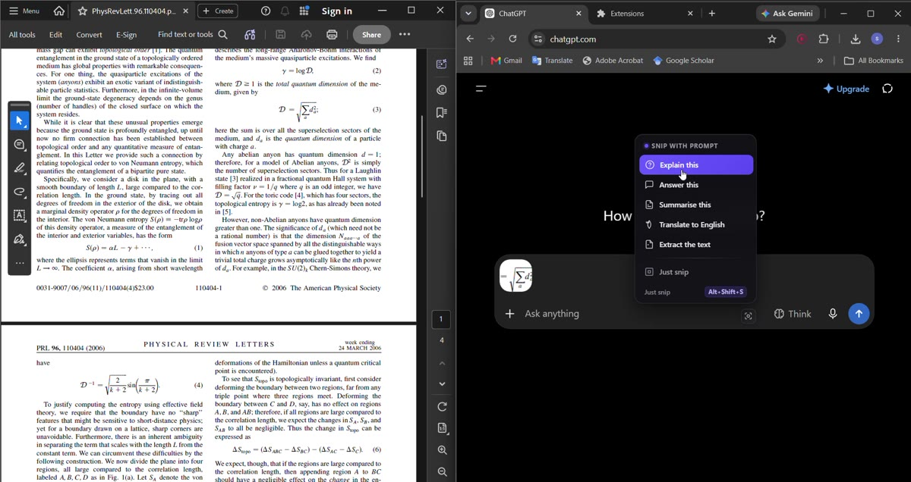

# SnipPaste

<p align="center">
  <br>
  <strong>Snip anything on your screen — it lands straight in your text box.</strong><br>
  Chrome extension for Windows · works inside websites, not apps
</p>

> **Right now only for Windows** — works in **Claude, Gemini, ChatGPT, Grok, Perplexity** websites (`chatgpt.com`, `claude.ai`, `gemini.google.com`…). **iOS and Android coming soon.**

### Demo

[](https://github.com/vipersouradip/snippaste/blob/main/demo.mp4)

<!-- To turn the thumbnail above into an inline player:
     1. Open this file on github.com · pencil (Edit) · drag demo-compressed.mp4 into the editor box.
     2. GitHub uploads it and inserts a https://github.com/user-attachments/assets/<uuid> link.
     3. Delete the thumbnail line above and leave that bare URL alone on its own line —
        no <video> tag, no , no <a href>. A bare attachment URL is what GitHub turns into a player.
     Only user-attachments / user-images.githubusercontent.com URLs embed this way;
     raw.githubusercontent.com and release-download links do not. -->

> Windows 11 · live recording · no cuts — drag any region → auto-pasted

### How it works

```
button → extension → helper → Windows overlay (ms-screenclip:) → PNG → paste into composer
```

Hover the button for prompts (Explain / Answer / Summarise / Translate / Extract).

### How to install

**1. Load extension:** `chrome://extensions` (Brave: `brave://extensions`, Edge: `edge://extensions`) → Developer mode → Load unpacked → select this folder

**2. Helper:** `powershell -ExecutionPolicy Bypass -File "native\install.ps1"` → restart browser

### Support

[☕ Buy me a coffee](https://buymeacoffee.com/vipersouradip) · [GitHub](https://github.com/vipersouradip/snippaste)
